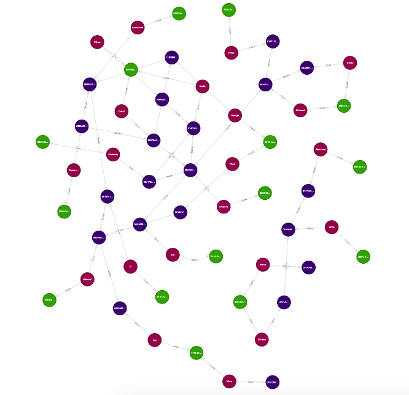

# When do you need graph modeling & querying?

Source code for the YouTube video on when you need graph modeling and querying.

## Setup

The minimum recommended Python version is 3.10+. We also recommend using the `uv` package manager
to manage dependencies. You can install `uv` using the following commands:

```bash
# On macOS via Homebrew
brew install uv

# On Linux
curl -LsSf https://astral.sh/uv/install.sh | sh

# On Windows
powershell -c "irm https://astral.sh/uv/install.ps1 | iex"
```

It's also recommended to set up a clean virtual environment before installing any dependencies.

```bash
# Create a virtual environment at .venv
uv venv

# On macOS and Linux
source .venv/bin/activate

# On Windows
.venv\Scripts\activate
```

Once you have the virtual environment set up, you can install the dependencies using
the provided `requirements.txt` file.

```bash
uv pip install -r requirements.txt
```

## Visualization

We will be visualizing graphs using its web-based UI, [Kùzu Explorer](https://docs.kuzudb.com/visualization/).
You can download the latest image of Kùzu Explorer from DockerHub provided using the provided `docker-compose.yml` file.
To do that, you can run the following commands in the directory where the `docker-compose.yml` is:
```bash
docker compose up
```

Alternatively, you can type in the following command in your terminal:

```bash
docker run -p 8000:8000 \
           -v ./ex_kuzu_db:/database \
           -v ./data:/data \
           -e MODE=READ_WRITE \
           --rm kuzudb/explorer:dev
```

---

## Problem statement

Imagine you are an investigator at an organization that tracks financial crimes. Two email addresses
(and the persons associated with them, named George and Edward)
have been flagged by law enforcement agencies, and both are now under suspicion for their potential
involvement in fraudulent activities.

Your goal is to analyze some data that consists of money transfers between individuals to assist in
the ongoing investigation. You'd typically have access to a relational database that contains
tables that store information about persons, accounts, and transfers between accounts. You'd therefore like to
model this data as a graph and write queries to answer some questions that could help you understand
the relationships between the two individuals and other persons in the network.

## Dataset

A financial network dataset of persons, accounts, addresses and transfers between accounts is provided.
Its schema can be represented as shown below.


A summary of the dataset is provided below:
- 21 nodes of type `Person`
- 21 nodes of type `Account` (each `Person` has exactly one account)
- 15 nodes of type `Address`
- 21 relationships of type `Transfer`, where the transfers are directed from a source account `s` that has transferred money
to a destination account `d`.

## Data modelling

The graph schema shown above is based on the following input files.
- `person.csv`
- `account.csv`
- `transfer.csv`

From a relational database perspective, we just have three tables. The person table has an address
column and the account table is connected to the person table via the person ID. The transfer table
contains the source and destination account IDs, and the amount transferred.

From the three tables we begin with, we are able to separate out the required columns for our node and
relationship tables in Kùzu, to give us the following six tables for our graph analysis:

- Node table: `Person`
- Node table: `Address`
- Node table: `Account`
- Relationship table: `Owns` (between `Person` and `Account`)
- Relationship table: `LivesIn` (between `Person` and `Address`)
- Relationship table: `Transfer` (between `Account` and `Account`)

## DDL

To insert data into the two databases, DuckDB and Kùzu, run the following Python scripts:

```bash
python insert_data_duckdb.py
python insert_data_kuzu.py
```

This completes the DDL and you are now ready to query either database!

## Graph visualization

The resulting graph from this dataset has interesting structures, and is small enough to visualize all at once
in Kùzu explorer. You can get the below visualization in Kùzu Explorer with the following query:
```cypher
MATCH (a)-[b]->(c) RETURN * LIMIT 200;
```



## SQL queries

The SQL queries that are possible to write for each corresponding Cypher query are provided in the `sql` directory.
it is not required to run these queries for the workshop -- they are provided for reference.

## Cypher queries

The goal of this workshop is to write Cypher queries to answer the questions provided below. Along
the way, we will visualize all query results in Kùzu Explorer and gain a deeper understanding of the
data.

## Queries to answer

| Query | Description
| --- | ---
| 1 | Find all possible direct transfers to the account owned by George <br>**Note:** We specify an explicit pattern in your `MATCH` clause that respects the schema, use a `WHERE` predicate to filter the target person by their email, and then `RETURN` all the connected persons who made on a direct transfer to the target person's account.
| 2 | Find all possible connections of type `Transfer`, including indirect ones up to length k = 5, between the accounts owned by George and Edward. You can try k > 5 to also see how the number of paths increases rapidly. <br>**Note:** We specify variable-length or [recursive](https://docs.kuzudb.com/cypher/query-clauses/match/#match-variable-lengthrecursive-relationships) relationships in Cypher using the Kleene star operator `*` followed by the min and max length for the paths.
| 3 | Find the shortest connection of type `Transfer` between the accounts owned by George and Edward. <br>**Note:** Kùzu's Cypher dialect has a native clause to match [a single shortest path](https://docs.kuzudb.com/cypher/query-clauses/match/#single-shortest-path).
| 4 | Find **all** shortest connections of any type between the persons George and Edward. We are searching for any possible shortest paths, i.e., the labels of the edges do not have to be only `Owns` and `Transfer`; they can include `LivesIn` as well. That is, the path between the two people can consist of any sequence of _any_ labels. <br>**Note:** For this query, we use Cypher's flexible relationship matching using [multiple labels](https://docs.kuzudb.com/cypher/query-clauses/match/#match-relationships-with-multi-labels) or [any labels](https://docs.kuzudb.com/cypher/query-clauses/match/#match-relationships-with-any-label). Kùzu's Cypher also provides a clause to find [all shortest paths between nodes](https://docs.kuzudb.com/cypher/query-clauses/match/#all-shortest-paths), which can be used if you think there are multiple paths of the same shortest length and you want to retrieve all of them.
| 5 | Find 3 persons who have all transferred money to each other (in at least one direction). <br>**Note:** For this pattern query, we can eliminate duplicate results from undirected path matches. Cypher provides a [`DISTINCT`](https://docs.kuzudb.com/cypher/query-clauses/return/#using-distinct-for-duplicate-elimination) clause for this.
| 6 | **a)** Find an important account that has the highest number of incoming transactions. <br>**Note:** We use [group by and aggregate](https://docs.kuzudb.com/cypher/query-clauses/return/#group-by-and-aggregations) to *count* of incoming edges. For reference, all possible aggregate functions are [here](https://docs.kuzudb.com/cypher/expressions/aggregate-functions/). <br> **b)** Find an important account that has received the most dollars. <br>**Note:** Do a [group by and aggregate](https://docs.kuzudb.com/cypher/query-clauses/return/#group-by-and-aggregations) to *sum* of the amounts on the incoming edges.
| 7 | Find the accounts that are the "most central". We will use the notion of highest “betweenness centrality” (BC). <br> **Note:** This part is done in Python via the NetworkX library. A graph algorithms package will also be available in Kùzu soon, to make this a lot easier and faster, so stay tuned for more!

> [!NOTE]
> Betweenness centrality is a measure of the number of shortest paths that pass through a node. It is calculated as the number of shortest paths that pass through a node divided by the total number of shortest paths between all pairs of nodes.
