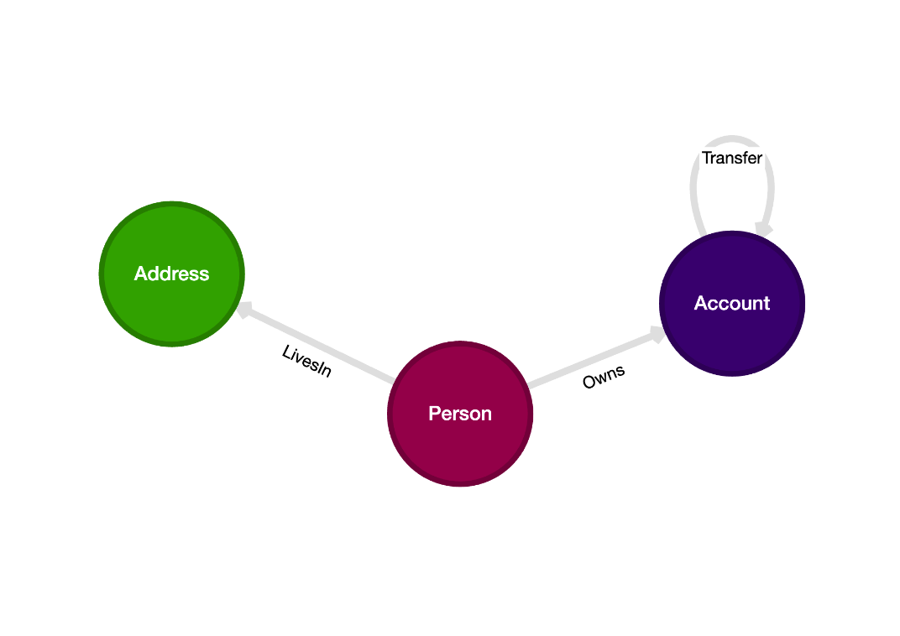
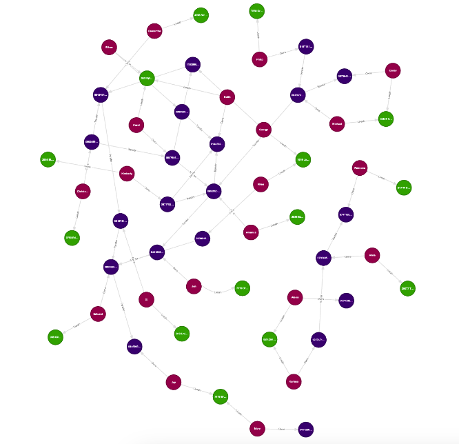

# A deep dive into Kùzu Explorer

Source code for the [YouTube video](https://www.youtube.com/watch?v=yKcVV_bhBTo) on using Kùzu Explorer.

## Dataset

A financial network dataset of persons, accounts, addresses and transfers between accounts is provided.

A summary of the dataset is provided below:
- 21 nodes of type `Person`
- 21 nodes of type `Account` (each `Person` has exactly one account)
- 15 nodes of type `Address`
- 20 relationships of type `TRANSFER`, where the transfers are directed from a source account `s` that has transferred money
to a destination account `d`.

## Data modelling

The above dataset can be modelled as a graph with the following schema.



We have the following six tables to copy into our graph database:

- Node table: `Person`
- Node table: `Address`
- Node table: `Account`
- Relationship table: `OWNS` (between `Person` and `Account`)
- Relationship table: `LIVES_IN` (between `Person` and `Address`)
- Relationship table: `TRANSFER` (between `Account` and `Account`)

## Running Kùzu Explorer

In this exercise, we will be exploring the graph using
[Kùzu Explorer](https://docs.kuzudb.com/visualization/), a browser-based UI for Kùzu.
Docker is required to run Kùzu Explorer.
You can run the latest version of Kùzu Explorer by pulling the image from DockerHub provided using
the provided `docker-compose.yml` file.

Run the following commands in the directory where the `docker-compose.yml` is:

```bash
docker compose up
```

Alternatively, you can type in the following command in your terminal:

```bash
docker run -p 8000:8000 \
           -v ./ex_kuzu_db:/database
           -e MODE=READ_WRITE \
           --rm kuzudb/explorer:latest
```

This will download and run the Kùzu Explorer image, and you can access the UI at `http://localhost:8000`.

## Graph visualization

The resulting graph from this dataset has interesting structures, and is small enough to visualize all at once
in Kùzu explorer. You can get the below visualization in Kùzu Explorer with the following query:
```cypher
MATCH (a)-[b]->(c) RETURN * LIMIT 200;
```


