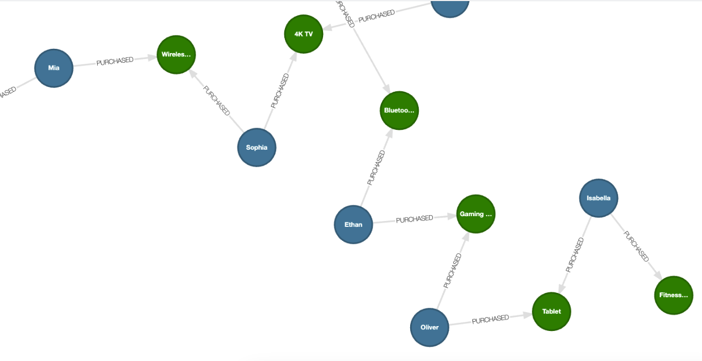

# A deep dive into graph visualization using Kùzu Explorer

Source code for the YouTube video on interoperability between Kùzu and various data formats and
external databases.

## Setup

The minimum recommended Python version is 3.10+. We also recommend using the `uv` package manager
to manage dependencies. You can install `uv` using the following commands:

```bash
# On macOS via Homebrew
brew install uv

# On Linux
curl -LsSf https://astral.sh/uv/install.sh | sh

# On Windows
powershell -c "irm https://astral.sh/uv/install.ps1 | iex"
```

It's also recommended to set up a clean virtual environment before installing any dependencies.

```bash
# Create a virtual environment at .venv
uv venv

# On macOS and Linux
source .venv/bin/activate

# On Windows
.venv\Scripts\activate
```

Once you have the virtual environment set up, you can install the dependencies using
the provided `requirements.txt` file.

```bash
uv pip install -r requirements.txt
```

## Visualization

Graph visualization is a great method to understand the structure and the "connectedness" of your data.
We will be visualizing graphs in Kùzu using its browser-based UI,
[Kùzu Explorer](https://docs.kuzudb.com/visualization/). Docker is required to run Kùzu Explorer.
You can run the latest version of Kùzu Explorer by pulling the image from DockerHub provided using
the provided `docker-compose.yml` file.

Run the following commands in the directory where the `docker-compose.yml` is:

```bash
docker compose up
```

Alternatively, you can type in the following command in your terminal:

```bash
docker run -p 8000:8000 \
           -v ./ex_kuzu_db:/database
           -e MODE=READ_WRITE \
           --rm kuzudb/explorer:latest
```

This will download and run the Kùzu Explorer image, and you can access the UI at `http://localhost:8000`.

Enter the following Cypher query in the shell editor to visualize the graph:

```cypher
MATCH (a)-[b]->(c)
RETURN *
LIMIT 200
```



## Steps

The steps to reproduce the graph shown in the video are as follows:

1. Ingest customer and product purchase data into Postgres `customer` and `purchased` tables
2. Ingest data to Kùzu from the `product.parquet` file and the Postgres tables on customer and
purchase history
3. Update the graph by adding historical sales quantity to each product
4. Update the graph by adding copurchase relationship between customers who bought the same product
5. Update the graph by adding recommendation edges to each customer

At each intermediate stage, you can visualize the graph to observe the changes.

### Step 1

Ingest customer and product purchase data into Postgres `customer` and `purchased` tables

```python
cd data
python insert_data_to_pg.py
```

This will ingest 15 customers and 30 purchase records into the `customer` and `purchased` tables.
The Postgres data is now available and ready to be used in the next step!

### Step 2

Ingest data to Kùzu from the `product.parquet` file and the Postgres tables on customer and
purchase history.

```python
python copy_from_sources.py
```

### Step 3

Update the graph by adding historical sales numbers as a property value to each `Product` node.

```python
python merge_historical_sales_properties.py
```

Once this step is done, you should see the `historical_sales` property as non-null values for each
`Product` node.

### Step 4

Update the graph by adding copurchase relationship between customers who bought the same product.

```python
python merge_copurchaser_edges.py
```

Once this step is done, you should see `copurchase` relationships between customers who bought
the same product.

### Step 5

Update the graph by adding recommendation edges for each customer.

```python
python merge_recommendation_edges.py
```

After this step, you are ready to generate recommendations for customers! You should see
`IS_RECOMMENDED` relationships between customers and products when you visualize the graph.

> [!NOTE]
> For certain customers, the number of `IS_RECOMMENDED` relationships may be 0. This is because
> we used a simple heuristic to determine if a product is recommended for a customer based on
> the product's `historical_sales` property and the customers' copurchasing patterns. To ensure
> a fixed number of recommendations, it's trivial to have a fallback mechanism that pads the number
> of recommendations to a fixed number by using the most popular products based on `historical_sales`.

## Run all the update steps in one go

Once you run the script `copy_from_sources.py`, you can run all the steps in one go by executing
the command below that utilizes the `update_graph.sh` script.

```bash
bash update_graph.sh
```
