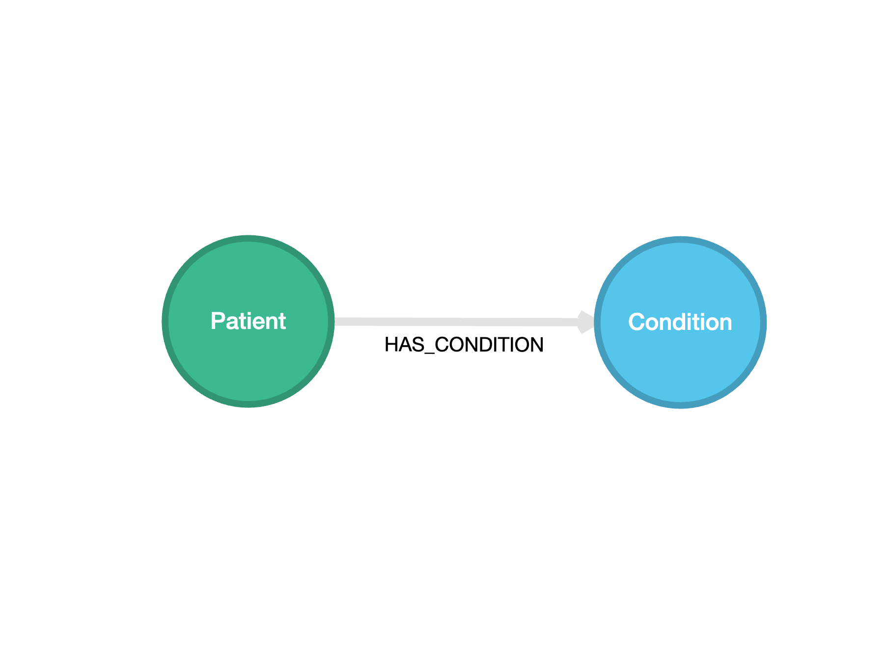
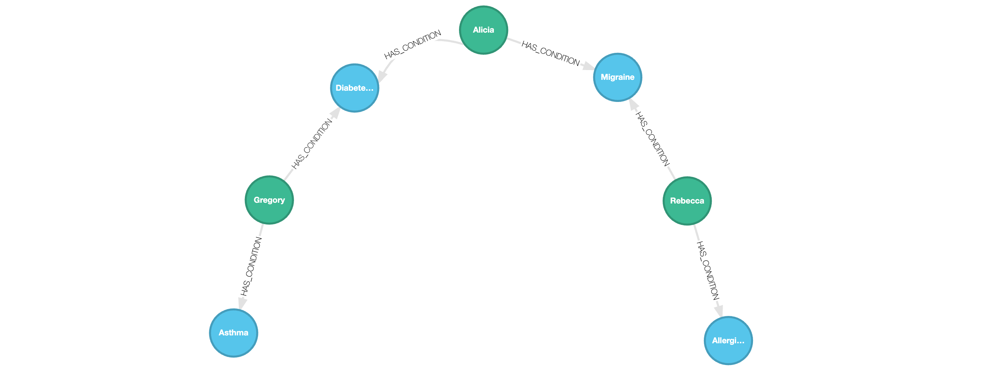

# Turn JSON data into a graph

Source code for the YouTube video on turning JSON data into a graph.

## Setup

The minimum recommended Python version is 3.10+. We also recommend using the `uv` package manager
to manage dependencies. You can install `uv` using the following commands:

```bash
# On macOS via Homebrew
brew install uv

# On Linux
curl -LsSf https://astral.sh/uv/install.sh | sh

# On Windows
powershell -c "irm https://astral.sh/uv/install.ps1 | iex"
```

It's also recommended to set up a clean virtual environment before installing any dependencies.

```bash
# Create a virtual environment at .venv
uv venv

# On macOS and Linux
source .venv/bin/activate

# On Windows
.venv\Scripts\activate
```

Once you have the virtual environment set up, you can install the dependencies using
the provided `requirements.txt` file.

```bash
uv pip install -r requirements.txt
```

## Visualization

Graph visualization is a great method to understand the structure and the "connectedness" of your data.
We will be visualizing graphs in Kùzu using its browser-based UI,
[Kùzu Explorer](https://docs.kuzudb.com/visualization/). Docker is required to run Kùzu Explorer.
You can run the latest version of Kùzu Explorer by pulling the image from DockerHub provided using
the provided `docker-compose.yml` file.

Run the following commands in the directory where the `docker-compose.yml` is:

```bash
docker compose up
```

Alternatively, you can type in the following command in your terminal:

```bash
docker run -p 8000:8000 \
           -v ./ex_kuzu_db:/database
           -e MODE=READ_WRITE \
           --rm kuzudb/explorer:latest
```

This will download and run the Kùzu Explorer image, and you can access the UI at `http://localhost:8000`.

Enter the following Cypher query in the shell editor to visualize the graph:

```cypher
MATCH (a)-[b]->(c)
RETURN *
LIMIT 200
```


## Steps

Run the script `ingest_json.py` to ingest the JSON data into Kùzu.

```bash
python ingest_json.py
```

The graph will have the following schema:



Once the data is ingested, you can run Cypher queries in the CLI shell or visualize the graph in
Kùzu Explorer. Below is an example visualization of the graph.


